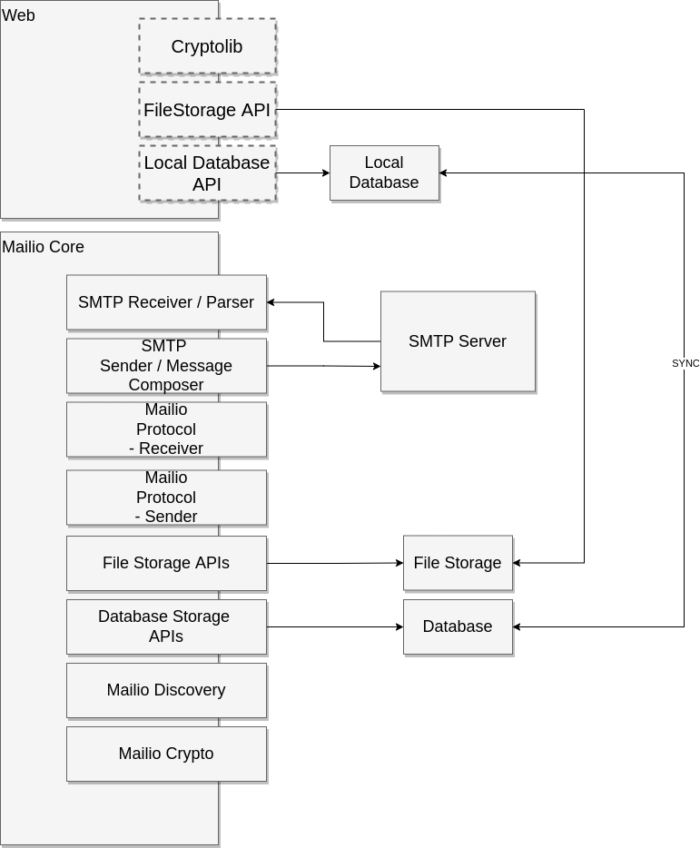

## Abstract

Mailio Architecture is aimed towards eventual decentralization and at the same time support the same functionalities as currently available on https://mail.io. 

## Motivation
Mailio Handshake feature is one of the main reasons for creation of Mailio. A slogan - *Pollution Control for Unwanted Email* did not fully live up to it's name, where receiving emails is based on inclusivity (priority for pre-approved senders) vs exclusivity (e.g. reporting spam, unsubscribing, ...). 

The efficient implementation proved difficult, if not impossible on SMTP protocol. Handshakes were based on autoresponders which lead to overwhelming bounce rates and reputation problems even when sending practices were spotless. There was also a problem with human component - people are nowadays very wary to click on automated email. 

This architecture aims to address those problems and deliver true Pollution Control for Unwanted Emails. 

## High Level Architecture

## Service dependencies

### Local Database

### SMTP Server

### File Storage

### Replicable Database

## Web Specification

Image depicts high level Mailio architecture. Mailio is highly modularized. This is a design concept allowing us to upgrade and most importantly test the components separately and independently. It also accomodates less friction when parallel upgrades are in motion.

### Cryptolib

This is Cryptolib. TBD

### FileStorage API

This is filestore api. TBD

### Local Database API

This is local db API. TBD 

## Core Mailio Specification

### SMTP Receiver / Parser

### SMTP Sender / Message Composer

### Mailio Protocol Receiver

### Mailio Protocol Sender / Message Composer

### File Storage APIs

### Database Storage APIs

### Mailio Discovery

### Mailio Crypto

## Rationale

The rationale fleshes out the specification by describing what motivated the design and why particular design decisions were made. It should describe alternate designs that were considered and related work, e.g. how the feature is supported in other languages.

## Reference Implementation
An optional section that contains a reference/example implementation that people can use to assist in understanding or implementing this specification. If the implementation is too large to reasonably be included inline, then consider adding it as one or more files in `../assets/mir-####/`.

## Security Considerations
All MIRs must contain a section that discusses the security implications/considerations relevant to the proposed change. Include information that might be important for security discussions, surfaces risks and can be used throughout the life cycle of the proposal. E.g. include security-relevant design decisions, concerns, important discussions, implementation-specific guidance and pitfalls, an outline of threats and risks and how they are being addressed. MIR submissions missing the "Security Considerations" section will be rejected. An MIR cannot proceed to status "Final" without a Security Considerations discussion deemed sufficient by the reviewers.

## Copyright
Copyright and related rights waived via [CC0](https://creativecommons.org/publicdomain/zero/1.0/).

